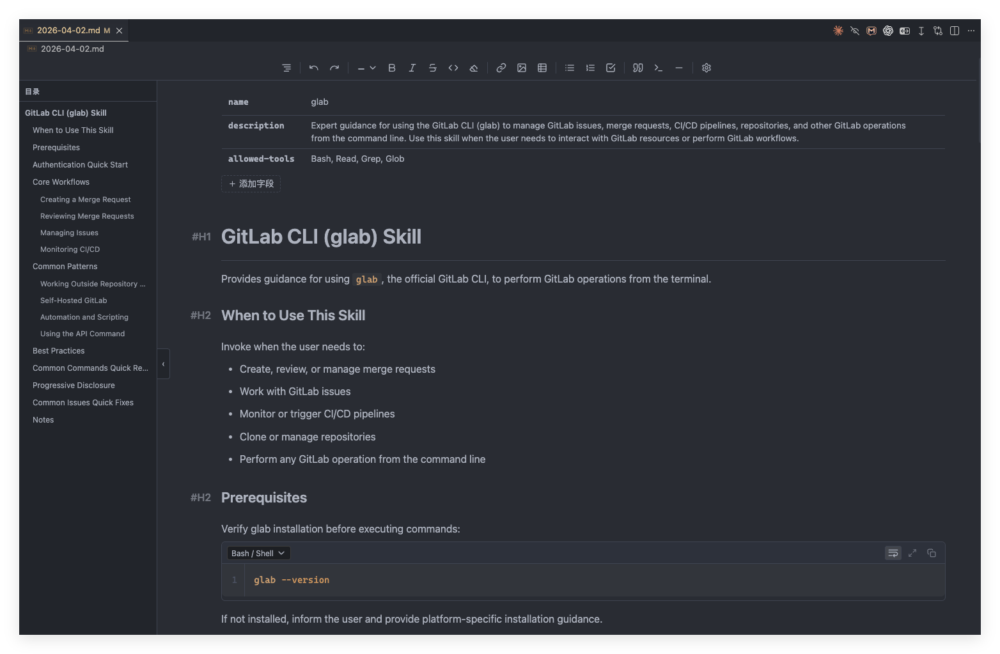
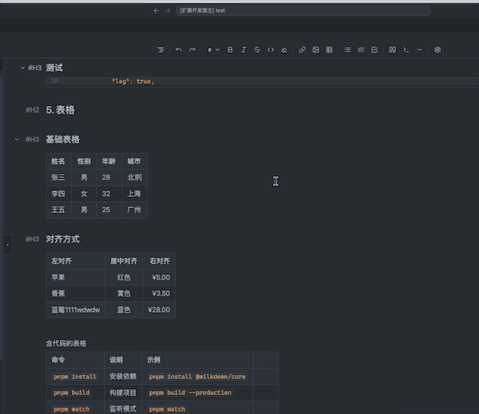

    

    <strong>English</strong>
    &nbsp;·&nbsp;
    <a href="./README.zh-CN.md">简体中文</a>
    &nbsp;·&nbsp;
    <a href="./i18n/docs/en/custom-themes.md">Custom Theme Configuration</a>

    
    
    
    
    

<h2 align="center">WYSIWYG Markdown Editor for VS Code</h2>

Write Markdown as naturally as editing a Word document

    Powered by <a href="https://milkdown.dev/">Milkdown</a> (ProseMirror) with a smooth editing experience, 
    saves as standard Markdown — fully compatible with Typora, Obsidian, and any other editor

## Editor Preview

---

## Features

### Rich Text Editing

- **Headings** (H1–H6), **bold**, *italic*, ~~strikethrough~~, `inline code`, blockquote, horizontal rule
- **Ordered / Unordered / Task lists** (click checkbox to toggle completion)
- **Links**: hover to show a popup for editing link text and URL inline; supports `@/` workspace paths, `#anchor` in-page jumps, and `file.md#27` line-number links
- **Path autocomplete**: type `@/`, `./`, or `../` inside inline code to get smart path suggestions — browse directories level by level with color-coded file-type icons

### Tables

- Full GFM table support
- **Grid selector**: hover the table icon to pick rows × columns before inserting
- Hover row/column borders to show **+ insert lines** — click to insert a row or column anywhere
- **Drag handles** on rows/columns: click to select, drag to reorder

### Code Blocks

- Syntax highlighting for 20+ languages
- Language picker with search filter
- One-click copy button
- Drag the bottom handle to resize the code block height
- Full-screen editor with syntax highlighting; writes back to document on close

### Mermaid Diagrams

- Flowcharts, sequence diagrams, Gantt charts, class diagrams, and more rendered inline
- Toggle between source code and rendered preview
- Zoom, pan (drag / trackpad pinch), and full-screen lightbox

### Images

- **Paste** an image from the clipboard, **drag-and-drop** a file, or use the **file picker** to insert images
- Local storage with MD5 deduplication, or configure a custom server upload endpoint
- Click an image to select it; click again to open a lightbox preview
- Toolbar for editing alt text, renaming the file, or deleting the image

### Custom Themes

- Support for custom color themes via `markdownWysiwyg.customThemes` configuration
- Define themes in `.vscode/settings.json` with custom name and VS Code color IDs
- Select custom themes from the Command Palette: "Select Markdown Theme"
- See [Custom Theme Configuration](i18n/docs/en/custom-themes.md) for details

### Table of Contents (TOC)

- Auto-generated from document headings
- Auto-opens when the window is wide enough; toggle manually via the side tab
- Click an entry to smooth-scroll to the heading

### Toolbars

- **Top toolbar**: heading level, bold, italic, strikethrough, ordered/unordered list, task list, blockquote, code block, table — automatically collapses into an overflow dropdown menu on narrow viewports
- **Floating selection toolbar**: appears on text selection; supports quick formatting and Send to Claude
- **Table toolbar**: appears on row/column selection; supports alignment and delete operations

### Search & Replace

- **`Cmd+F`** (macOS) / **`Ctrl+F`** (Windows): opens the FindBar to search within the document
- **Drag-to-resize**: drag the handle to make the search bar taller for replace mode
- **Regex** and **Match Case** toggle buttons
- Matches highlighted in real time using the CSS Custom Highlight API; colors follow your VS Code theme
- Navigate matches with `Enter` / `Shift+Enter`, dismiss with `Esc`

### Claude Integration

- **`Option+K`** (macOS) / **`Alt+K`** (Windows): sends the paragraph under the cursor to Claude with precise file line numbers
- Select text and click "Send to Claude" in the toolbar — also attaches line range
- Automatically detects Claude terminal / Claude VSCode extension / VS Code built-in Chat with three-level fallback

### Auto Save

- Automatically writes to disk **1 second** after editing stops — no need to press `Cmd+S` / `Ctrl+S`
- Can be disabled; manual save shows `●` in the tab title
- External file changes (e.g. `git checkout`, other editors) sync automatically to the editor

---

## Getting Started

After installing the extension, open any `.md` / `.markdown` file in VS Code — it opens in WYSIWYG mode automatically.

| Action                   | How                                                            |
| ------------------------ | -------------------------------------------------------------- |
| Switch to text editor    | Click the 👁 icon in the title bar, or right-click → Open With |
| Switch back to WYSIWYG   | Click the 👁 icon in the title bar                             |
| Insert table (grid)      | Hover the table icon, then drag to select rows × columns       |
| Insert row/column        | Hover a table row/column border, click **+**                   |
| Reorder rows/columns     | Hover the **⠿** handle, then drag                              |
| Select entire row/column | Click the **⠿** handle                                         |
| Path autocomplete        | Type `@/`, `./`, or `../` inside inline code                   |
| Send paragraph to Claude | `Option+K` (macOS) / `Alt+K` (Windows)                         |
| Search in document       | `Cmd+F` (macOS) / `Ctrl+F` (Windows)                           |
| Manual save              | `Cmd+S` (macOS) / `Ctrl+S` (Windows)                           |

---

## Settings

| Setting                              | Type    | Default     | Description                                                   |
| ------------------------------------ | ------- | ----------- | ------------------------------------------------------------- |
| `markdownWysiwyg.autoSave`           | boolean | `true`      | Automatically save to disk after editing                       |
| `markdownWysiwyg.autoSaveDelay`      | number  | `1000`      | Debounce delay in milliseconds for auto-save                  |
| `markdownWysiwyg.defaultMode`        | string  | `"preview"` | Default mode when opening `.md`: `preview` or `markdown`      |
| `markdownWysiwyg.codeBlockMaxHeight` | number  | `600`       | Maximum code block height in pixels                            |
| `markdownWysiwyg.editorMaxWidth`     | number  | `900`       | Maximum editor content width in pixels                         |
| `markdownWysiwyg.fontFamily`         | string  | `""`        | Editor font family; leave empty to inherit VS Code editor font |
| `markdownWysiwyg.imageStorage`       | string  | `"local"`   | Image storage mode: `local` or `server`                       |
| `markdownWysiwyg.imageLocalPath`     | string  | `""`        | Relative path (from workspace root) for local image storage   |
| `markdownWysiwyg.colorTheme`         | string  | `"auto"`    | Color theme: `auto` follows VS Code, or set a theme ID        |
| `markdownWysiwyg.tableWrap`          | string  | `"normal"`  | Table cell text wrapping: `normal`, `aggressive`, or `none`   |
| `markdownWysiwyg.customThemes`       | array   | `[]`        | Custom color themes array. See [Custom Theme Configuration](i18n/docs/en/custom-themes.md) |

---

## Requirements

- VS Code **1.80.0** or later

---

## Known Limitations

- Many proprietary Markdown formats are not yet supported
- Some advanced Markdown extensions (footnotes, math formulas) are not yet supported
- **Global search navigation**: clicking a search result for a `.md` file may not scroll to the matched line in WYSIWYG mode when multiple `.md` files are open simultaneously

---

## License

[MIT License](LICENSE)
