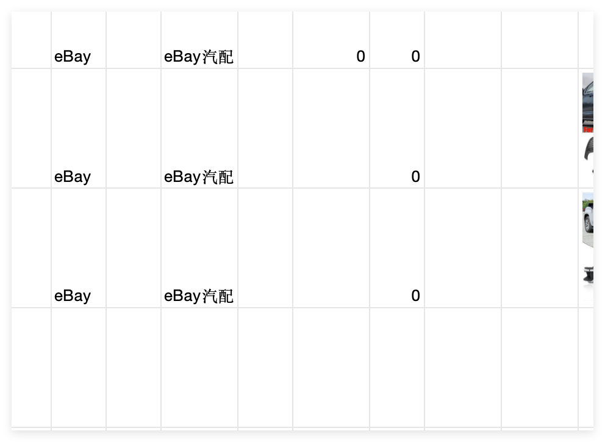
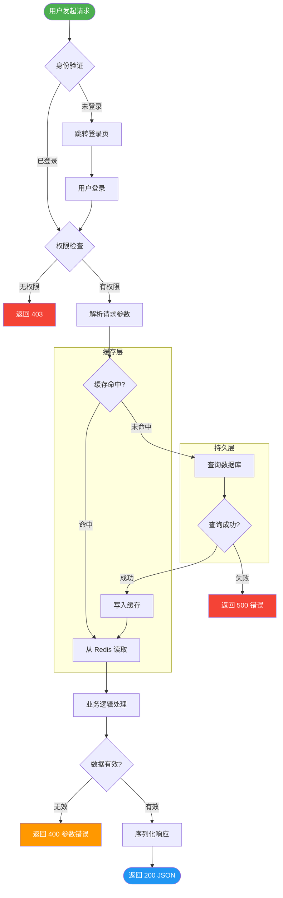
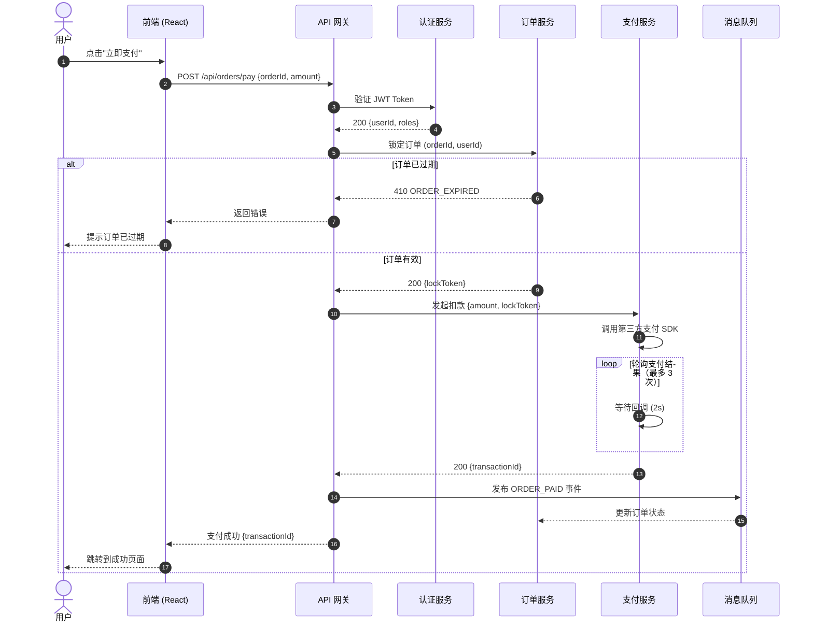
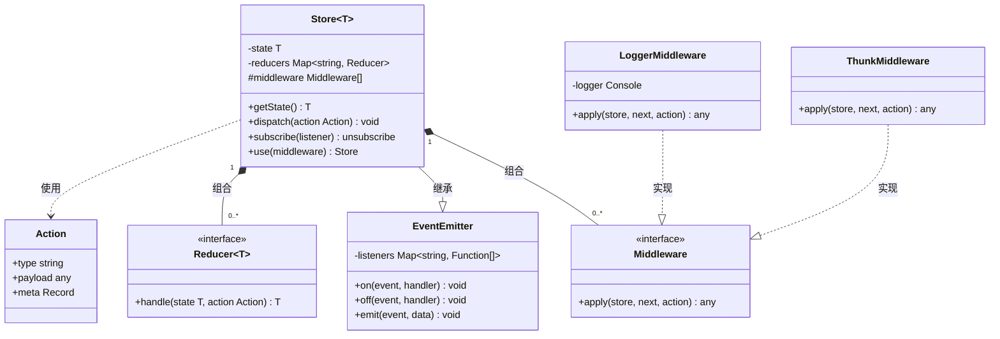
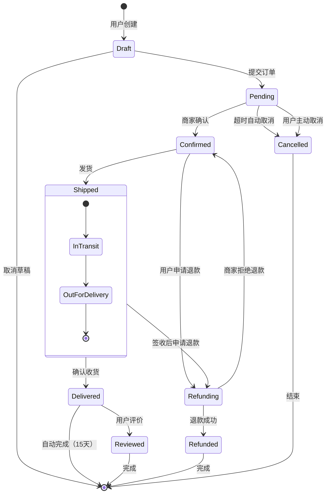
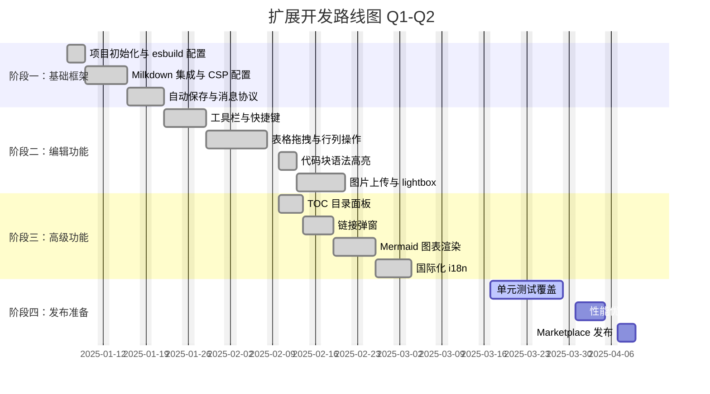

# Markdown 全场景测试文档

> 本文件用于验证 Markdown WYSIWYG 编辑器的所有渲染场景。

*~~baidu12~~* **粗体**细体

# #H1 一级标题

## H2 二级标题

### H3 三级标题akwhdawd

#### H4 四级标题

### H5 五级标题

###### H6 六级标题

***

## 2. 文本样式

3

## 普通段落文本。这是第一段，**bundleawd**

**粗体文本** 和 *斜体文本* 以及 ***粗斜体文本***

~~删除线文本~~ 和 `行内代码 code` 并排显示

混合样式：**这是粗体，其中有** ***斜体*** **嵌套**`code`，还有 ~~删除~~ 和 `code`。

`123`



***

## 3. 列表

### 无序列表

- 苹果

- 香蕉

- 橙子

  - 血橙

  - 脐橙

    - 赣南脐橙
    - <br />

* 葡萄

### 有序列表

1. 第一步：安装依赖
2. 第二步：配置环境
3. 第三步：启动服务

   1. 启动数据库
   2. 启动后端

      1. 检查日志
      2. 分析日志
      3. 上传日志
   3. 启动前端
   4. <br />
4. 第四步：验证功能

### 任务列表

- [x] 完成项目初始化

- [ ] 集成 Milkdown 编辑器

- [x] 修复复选框渲染问题

- [ ] 添加表格右键菜单

- [x] 发布第一个版本
  - [x] 准备 README

* [x] 打包 .vsix 文件

<br />

```
123
```

***

## 4. 代码块

行内代码

##### 使用 `pnpm install` 安装依赖，使用 `pnpm build` 构建项目。

**或者** *~~`pnpm install`~~*

### TypeScriptjava

```javascript
import { Editor, rootCtx } from '@milkdown/core';
i@milkdown/preset-commonmark';

async function createEditor(container: HTMLElement): Promise<Editor> {
  return Editor.make()
    .config((ctx) => {
      ctx.set(rootCtx, container);
    })
    .use(commonmark)
    .create();
}
import { Editor, rootCtx } from '@milkdown/core';
import { commonmark } from '@milkdown/preset-commonmark';

async function createEditor2(container: HTMLElement): Promise<Editor> {
  return Editor.make()
    .config((ctx) => {
      ctx.set(rootCtx, container);
    })
    .use(commonmark)
    .create();
}
```

<br />

### Shell 命令

```bash

# 安装依赖
pnpm install

# 开发模式（监听文件变化）
pnpm watch

# 生产构建
pnpm build --production


```

### JSON 配置

```json
{
  "name": "markdown-wysiwyg-editor",
  "contributes": {
    "customEditors": [
      {
        "viewType": "markdownWysiwyg.editor",
        "priority": "default"
      }
    ]
  }
}
```

***

## 5. 表格

### 基础表格

| 姓名 |  性别 | 年龄 | 城市 | <br /> |
| -- | :-: | -- | -- | :----- |
| 张三 |  男  | 28 | 北京 | <br /> |
| 李四 |  女  | 32 | 上海 | <br /> |
| 王五 |  男  | 25 | 广州 | <br /> |

### 对齐方式

| 左对齐         | 居中对齐 |    右对齐 |
| :---------- | :--: | -----: |
| 苹果          |  红色  |  ¥5.00 |
| 香蕉          |  黄色  |  ¥3.50 |
| 蓝莓1111wdwdw |  蓝色  | ¥28.00 |

<br />

含代码的表格

| 命令             | 说明   | 示例                            | <br /> |
| -------------- | ---- | ----------------------------- | :----- |
| `pnpm install` | 安装依赖 | `pnpm install @milkdown/core` | <br /> |
| `pnpm build`   | 构建项目 | `pnpm build --production`     | <br /> |
| `pnpm watch`   | 监听模式 | `pnpm watch`                  | <br /> |

<br />

## 6. 引用块

> 这是一段普通引用。引用内容通常来自外部资料或他人的话语。

> **嵌套引用：**
>
> > 这是嵌套的引用内容，可以表示对话或多层引用。
>
> 引用可以包含 **粗体**、*斜体* 和 `代码`。

> ### 引用中的标题
>
> 引用块内也可以包含列表：
>
> - 条目一
> - 条目二

***

## 7. 链接与图片

### 链接[123](312)

[Milkdown 官网 ](https://milkdown.dev)

[带标题的链接](https://github.com/Milkdown/milkdown "Milkdown GitHub 仓库") 我的

自动链接：<https://milkdown.dev>

123123

### 图片

<br />

<br />

***

## 8. 水平分割线

上方内容

***

中间内容

***

下方内容

***

## 9. 特殊文本

### 转义字符

\*不是斜体\* 和 \`不是代码\` 和 # 不是标题

### 长段落换行

Lorem ipsum dolor sit amet, consectetur adipiscing elit. Sed do eiusmod tempor incididunt ut labore et dolore magna aliqua. Ut enim ad minim veniam, quis nostrud exercitation ullamco laboris.

第二段落。中文长段落测试123：工欲善其事，必先利其器。磨刀不误砍柴工。一寸光阴一寸金，寸金难买寸光阴。

***

## 10. 综合示例

### 项目清单

|     功能     |  状态 |       备注       |
| :--------: | :-: | :------------: |
| WYSIWYG 编辑 |  ✅  | 基于 Milkdown v7 |
|    自动保存    |  ✅  |      1s 防抖     |
|    表格编辑    |  🚧 |       开发中      |
|    模式切换    |  🚧 |       开发中      |

### 代码审查清单

- [x] 无语法错误
- [x] 类型检查通过
- [ ] 单元测试覆盖率 > 80%
- [ ] 无安全漏洞
- [x] 性能达标（FCP < 1s）
- [ ] 文档已更新中间内容

***

## 11. Mermaid 图表

### 流程图（复杂分支 + 子图）



### 时序图（微服务调用链）



### 类图（设计模式示例）



### 状态机（订单生命周期）



### Gantt 甘特图（项目排期）



### 错误语法测试（验证错误提示）

```mermaid
flowchart TD
    A --> B -->
    INVALID SYNTAX HERE @@@@
    --> missing node
```
